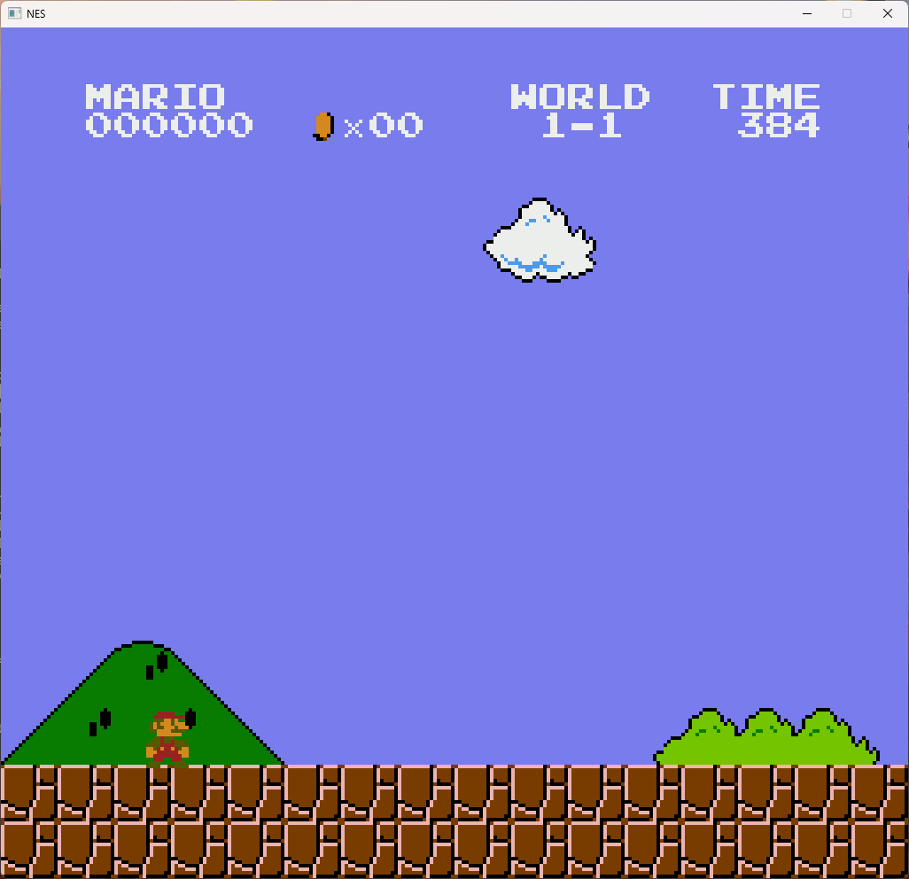
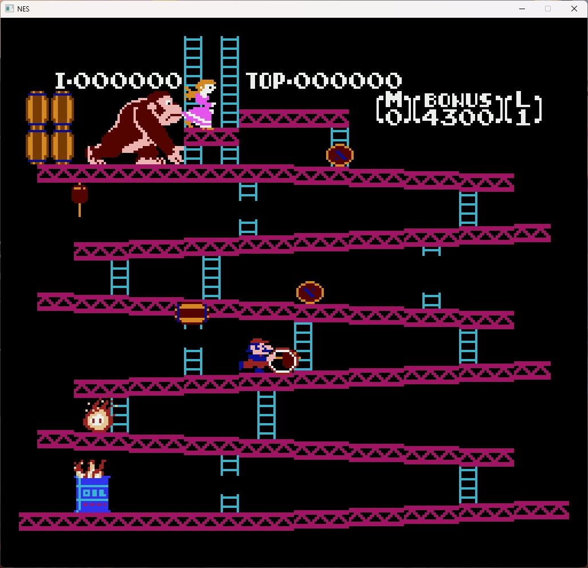

# NES Emulator

A basic, fully functional NES Emulator. I made this project to get more familiar with NES 
architecture and structure of similar systems. It's not 100% cycle accurate but it reliably runs 
most games with mapper 0 and vertical/horizontal scrolling.





# Requirements

The only requirements to build the app are:
* git
* CMake 3.8 or newer

Other external dependencies will be downloaded, compiled and linked locally by CMake in the build 
directory. 

# Building the application

In case you'd like to clone and build the application with the help of a certain IDE consult the
documentation. Otherwise change the directory to the desired directory for the source files and 
clone the repository:
```
cd <path/to/source/dir>
git clone https://github.com/JulianKonowalski/NES_emulator.git
```
Create a build directory and run CMake:
```
mkdir build
cd build
cmake ..
make
```

# Usage

The application can be started from the console window. In the app directory run:
```
./NESEmulator.exe <path/to/iNES/file>
```
or analogically on Linux:
```
./NESEmulator <path/to/iNES/file>
```

# Supported games

The emulator supports iNES 1.0 files with games based on mapper 0 and with vertical/horizontal
scrolling. Games with onboard RAM modules are not supported. Some of them (like Super Mario Bros) 
can be played, but the graphics may not work correctly and the player won't be able to make a 
gamesave. Games with mappers other than mapper 0 won't boot. Scrolling modes other than vertical or
horizontal will result in unexpected behaviour (most probably graphical glitches).